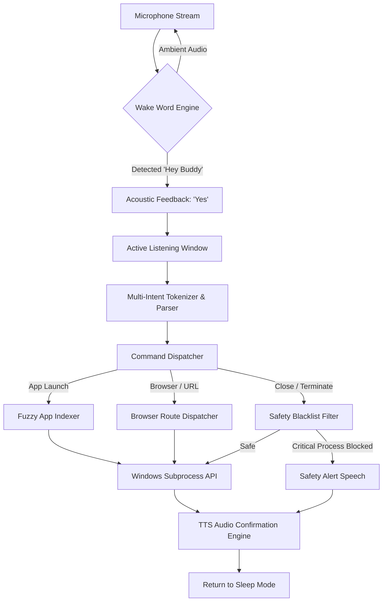

# 🎙️ Hermes AI Voice Assistant

<div align="center">


**An intelligent, low-latency desktop voice assistant and automation agent for Windows.**
*Hands-free application management, multi-intent command parsing, browser tab navigation, and built-in system safety protections.*

[Key Features](#-key-features) • [Architecture](#-architecture) • [Quick Start](#-quick-start) • [Versions](#-versions) • [Command Catalog](#-command-catalog) • [Safety Layer](#-system-safety-layer) • [Configuration](#-configuration)

</div>

---

## 📖 Overview

**Hermes** is a voice agent engineered for Windows power users and developers. It combines real-time acoustic speech recognition, scored fuzzy string matching for system app discovery, compound multi-action command dispatching, and offline text-to-speech feedback.

Hermes operates with a **wake-word activation model ("Hey Buddy")**, entering an active interactive listening window before safely returning to ambient low-power sleep.

---

## 🚀 Versions

Hermes comes in two editions to suit different preferences:

### 🛡️ **Classic Edition** (Original)
- Reliable, bulletproof implementation
- Strict "open X and Y" command parsing
- 8-second session timeout after wake word
- Maximum safety with extensive process blacklisting

### 🤖 **Jarvis Edition** (Enhanced)
- Natural language understanding (like J.A.R.V.I.S. from Iron Man)
- Conversational English comprehension
- Context-aware responses ("open it again", "close it")
- 30-second session timeout for extended conversations
- More human-like TTS responses
- Background indexing for faster startup

---

## ✨ Key Features

| Capability | Description |
| :--- | :--- |
| **🎙️ Wake-Word Engine** | Continuous background listener calibrated for `"Hey Buddy"` with dynamic ambient noise auto-adjustment. |
| **🔗 Multi-Intent Parser** | Chained command execution in a single breath (e.g., `"open X and open Y and close Z"`). |
| **🔍 Scored Fuzzy Discovery** | Automatically indexes Windows Start Menu, Program Files, AppData, and Registry to match spoken names (e.g. `"anti gravity"` → `anti-gravity.exe`). |
| **🛡️ Bulletproof Safety** | Kernel-level process blacklist preventing voice commands from terminating critical Windows services (`explorer.exe`, `csrss.exe`, `svchost.exe`). |
| **🌐 Browser & Tab Routing** | Native dispatching to **Comet**, **Google Chrome**, and **Microsoft Edge** with keystroke tab controls (`new tab`, `close tab`, `switch tab`). |
| **🔊 Non-blocking TTS** | Instant spoken audio feedback on every execution state using native Windows SAPI5. |
| **🔒 100% Local & Private** | No audio recordings or telemetry are stored on disk or sent to external servers. |

---

## 🏗️ Architecture



---

## 🚀 Quick Start

### Prerequisites
- **OS**: Windows 10 / 11 (64-bit)
- **Python**: 3.10 or higher
- **Microphone & Speaker**: Properly configured in Windows sound settings

### Installation

1. **Clone the Repository**
   ```bash
   git clone https://github.com/swarajshelke12/HermesVoiceAgent.git
   cd HermesVoiceAgent
   ```

2. **Set Up a Virtual Environment**
   ```bash
   python -m venv venv
   venv\Scripts\activate
   ```

3. **Install Dependencies**
   ```bash
   pip install SpeechRecognition pyttsx3 pyaudio
   ```

4. **Launch Hermes**

   **Classic Edition:**
   ```bash
   # Option A: Run directly via Python
   python hermes_assistant.py
   
   # Option B: Double-click the launcher script
   run_hermes.bat
   ```

   **Jarvis Edition:**
   ```bash
   # Option A: Run directly via Python
   python hermes_jarvis.py
   
   # Option B: Double-click the launcher script
   run_hermes_jarvis.bat
   ```

Once initialized, you will see `Hermes ready` and hear audio confirmation. Say **"Hey Buddy"** to begin.

---

## 🗣️ Command Catalog

Always wake Hermes with **"Hey Buddy"**, followed by your command(s):

### 1. Launching Applications
Hermes utilizes scored fuzzy search to locate desktop applications, Microsoft Store packages, and local binaries.
```text
"Hey Buddy, open Spotify"
"Hey Buddy, open File Explorer"
"Hey Buddy, open Visual Studio Code"
"Hey Buddy, open Anti Gravity"
"Hey Buddy, open Notepad and open Spotify"
```

### 2. Terminating Applications
Hermes safely kills user-space processes while strictly rejecting system-critical tasks.
```text
"Hey Buddy, close Spotify"
"Hey Buddy, close Notepad and close Chrome"
"Hey Buddy, kill Discord"
```

### 3. Web & Browser Navigation
Supports direct website shortcuts and browser targeting (`Comet`, `Chrome`, `Edge`).
```text
"Hey Buddy, open GitHub"
"Hey Buddy, open YouTube in Chrome"
"Hey Buddy, open Google on Comet"
"Hey Buddy, open Gmail and open LinkedIn"
```

### 4. Comet Browser Tab Management
Executes native keyboard navigation commands within the active browser window:
```text
"Hey Buddy, new tab"        -> Opens new browser tab
"Hey Buddy, close tab"      -> Closes current active tab
"Hey Buddy, switch tab"     -> Cycles to next open tab
"Hey Buddy, previous tab"   -> Returns to previous tab
```

### 5. System Folders & Directories
```text
"Hey Buddy, open Downloads"
"Hey Buddy, open Desktop"
"Hey Buddy, open Documents"
```

### 6. Natural Language Commands (Jarvis Edition Only)
```text
"Hey Buddy, can you open Spotify please?"
"Hey Buddy, I need to check my email"
"Hey Buddy, close Chrome and open Firefox"
"Hey Buddy, launch Photoshop and start a new design"
"Hey Buddy, play some music on Spotify"
"Hey Buddy, open it again"  # Reopens last opened item
"Hey Buddy, close it"       # Closes last opened item
```

### 7. Session Termination
```text
"Hey Buddy, goodbye"
"Hey Buddy, stop"
"Hey Buddy, exit"
```

---

## 🛡️ System Safety Layer

To prevent system lockups, blue screens, or desktop disappearance, Hermes enforces an un-bypassable **Critical Process Blacklist**:

```python
CRITICAL_PROCESS_BLACKLIST = {
    "explorer", "csrss", "svchost", "system", 
    "smss", "wininit", "services", "lsass", "fontdrvhost"
}
```

- **Protected System Shell**: Commands like `"close explorer"` or `"kill system"` are immediately intercepted and safely blocked.
- **Graceful Fallbacks**: Uses scoped window title matching before resorting to force-kill parameters.

---

## ⚙️ Configuration

Custom system aliases, energy calibration levels, and browser preferences can be tuned in `hermes_assistant_config.json` or at the top of each Python file:

```json
{
  "wake_word": "hey buddy",
  "command_timeout_seconds": 8.0,
  "default_browser": "comet",
  "speech_energy_threshold": 80,
  "voice_feedback_enabled": true
}
```

---

## 📁 Repository Structure

```
HermesVoiceAssistant/
├── hermes_assistant.py          # Core engine (Classic Edition)
├── hermes_jarvis.py             # Enhanced natural language edition (Jarvis)
├── hermes_assistant_config.json # Runtime preferences and user mappings
├── run_hermes.bat               # Windows double-click launcher (Classic)
├── run_hermes_jarvis.bat        # Windows double-click launcher (Jarvis)
├── BUILD.md                     # Detailed build logs and technical architecture
├── DEV_LOG.md                   # Engineering changelog and release history
└── README.md                    # Project documentation
```

---

## 👨‍💻 Author

**Swaraj Shelke**  
*AI Systems & Automation Engineer*  
- GitHub: [@swarajshelke12](https://github.com/swarajshelke12)  
- Portfolio: [jexor.studio](https://github.com/swarajshelke12)

---

## 📄 License

This project is licensed under the **MIT License** — see the [LICENSE](LICENSE) file for details.