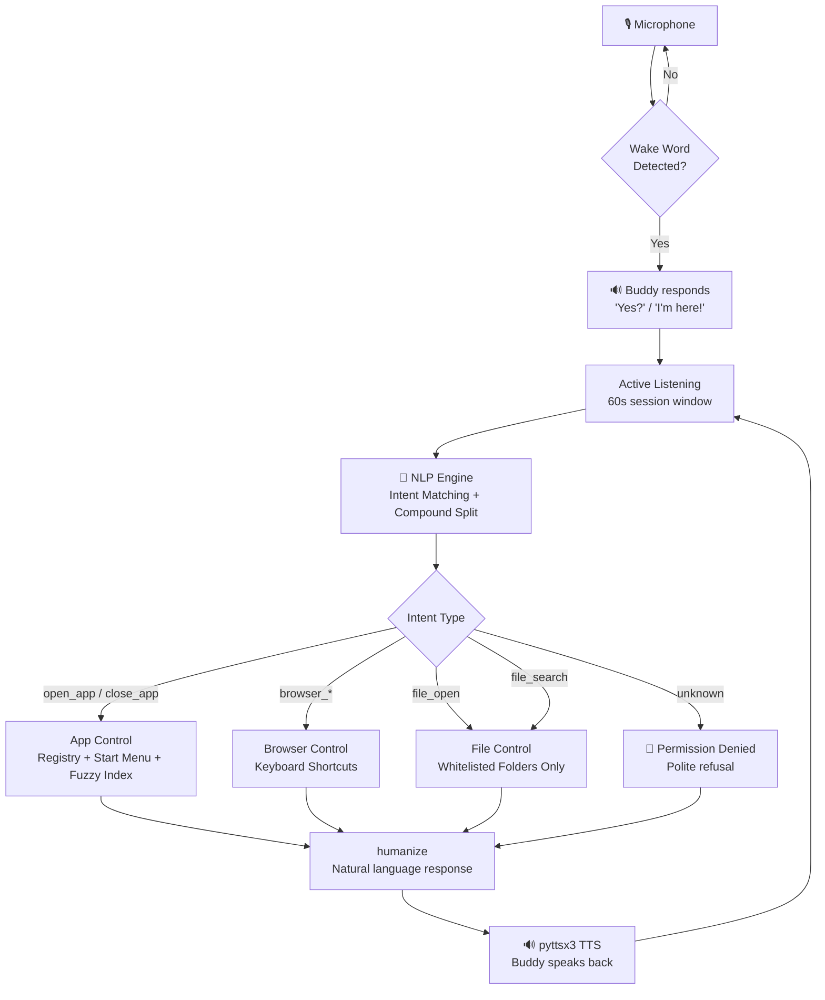

<div align="center">

<!-- Animated title using SVG -->
<a href="https://github.com/swarajshelke12/BuddyAssistant-">
  
</a>

<br />


<br /><br />

<!-- Badges -->


<br />

**[Quick Start](#-quick-start)** · **[What It Can Do](#-what-buddy-can-do)** · **[How It Works](#-how-it-works)** · **[Voice Commands](#-voice-command-reference)** · **[Architecture](#-architecture)**

</div>

---

<br />

## ⚡ What Is Buddy Agent?

> *"Hey Buddy, open Chrome and search YouTube."*

That's it. That's the whole idea.

**Buddy Agent** is a voice-activated laptop operator for Windows. Not just a smart speaker shortcut, not just a macro runner — a real agent that **understands natural English**, figures out what you mean, and **actually does it**. Open apps. Control your browser. Search your files. Switch tabs. All hands-free, all offline, all private.

Think **J.A.R.V.I.S.** — minus the Iron Man suit, plus your actual laptop.

<br />

---

## ✨ What Buddy Can Do

<br />

<div align="center">

| 🎯 Capability | 💬 Example |
|:---|:---|
| **Launch any app** | *"Open Discord"*, *"Start VS Code"*, *"Launch Spotify"* |
| **Close any app** | *"Close Chrome"*, *"Quit Notepad"* |
| **Browser tabs** | *"Open a new tab and search YouTube"*, *"Close this tab"* |
| **Web search** | *"Search for Python tutorials"*, *"Google the weather"* |
| **Navigate anywhere** | *"Go to github.com"*, *"Open YouTube"*, *"Visit Reddit"* |
| **Browser controls** | *"Go back"*, *"Refresh the page"*, *"Open incognito"* |
| **Open folders** | *"Open my Downloads"*, *"Show my Desktop folder"* |
| **Search files** | *"Find a file called resume"*, *"Search for budget"* |
| **Chain commands** | *"Open Chrome and search YouTube"* all in one breath |
| **Context awareness** | *"Close it"* → closes what you just opened |

</div>

<br />

---

## 🔐 Built With Safety First

Buddy Agent is **permission-locked by design**. It only has access to exactly three domains:

```
✅  Open and close applications
✅  Control your browser  (tabs, search, navigate)
✅  Open common folders   (Desktop, Downloads, Documents, Pictures, Music, Videos)
```

That's the full list. There's no keyboard snooping, no system command execution, no arbitrary file modification, no screenshots, no shutdown commands, no volume changes — **nothing else**. Any request outside this boundary is politely declined.

<br />

> [!NOTE]
> The unused modules (`system_control`, `window_control`, `keyboard_control`) aren't just disabled — they were **deleted from disk** entirely so they can't be accidentally re-enabled.

<br />

---

## 🚀 Quick Start

### Prerequisites

- **OS**: Windows 10 or 11 (64-bit)
- **Python**: 3.10 or higher
- **Microphone**: Any working mic, configured in Windows Sound settings
- **Internet**: Required for speech recognition (Google STT) — everything else runs offline

<br />

### 1 · Clone the repo

```bash
git clone https://github.com/swarajshelke12/BuddyAssistant-.git
cd BuddyAssistant-
```

### 2 · Create a virtual environment

```bash
python -m venv venv
venv\Scripts\activate
```

### 3 · Install dependencies

```bash
pip install SpeechRecognition pyttsx3 pyaudio pyautogui pyperclip psutil pywin32
```

### 4 · Run it

```bash
# Option A — Python directly
python buddy_assistant.py

# Option B — Double-click the one-click launcher
run_buddy.bat
```

<br />

Once it starts, you'll see the activation banner and hear a startup chime. Then:

```
Say → "Hey Buddy"   (or "Hey Hermes" or "Hey Jarvis")
Wait → "Yes?" / "I'm here!" / "What's up?"
Say → your command
```

<br />

---

## 🗣️ Voice Command Reference

> Wake Buddy first: **"Hey Buddy"** *(alternates: "Hey Hermes", "Hey Jarvis")*

<br />

### 📱 Apps

```
"Open Chrome"
"Launch Spotify"
"Start VS Code"
"Close Discord"
"Quit Notepad"
"Close it"              ← closes whatever you last opened
"Open it again"         ← reopens whatever you last opened
```

<br />

### 🌐 Browser

```
"Open a new tab"
"Open a new tab and search YouTube"
"Search for Python tutorials"
"Go to github.com"
"Close this tab"
"Next tab"
"Previous tab"
"Go back"
"Go forward"
"Refresh the page"
"Open incognito"
"Bookmark this page"
"Zoom in" / "Zoom out"
"Scroll down" / "Scroll up"
"Open browser history"
```

<br />

### 📁 Folders

```
"Open my Downloads"
"Open my Documents"
"Open the Desktop folder"
"Show my Pictures"
"Open my Music"
"Open Videos"
```

<br />

### 🔍 File Search

```
"Search for resume"
"Find a file called budget"
"Look for presentation"
"Do I have a file called notes?"
```

<br />

### 💬 Conversation

```
"Hello"  /  "Hey"  /  "Hi"        ← Buddy greets you back
"Goodbye"  /  "Bye"  /  "Stop"    ← ends the session
```

<br />

### 🔗 Chained Commands *(the cool part)*

```
"Open Chrome and search YouTube"
"Close Spotify and open VLC"
"Open a new tab and go to reddit.com"
"Can you please open Discord"          ← polite words stripped automatically
"I want to launch Spotify"             ← natural phrasing understood
```

<br />

---

## ⚙️ How It Works

<br />

```
You speak
    ↓
Wake word detection  ("Hey Buddy" / "Hey Hermes" / "Hey Jarvis")
    ↓
Google Speech-to-Text (en-IN → en fallback)
    ↓
NLP Engine  (regex intent matching, compound command splitting, context resolution)
    ↓
Dispatcher  (routes to the right module)
    ↓
         ┌──────────────┬─────────────────┬─────────────────┐
         ▼              ▼                 ▼                 ▼
    App Control    Browser Control   File Control     Denied ✗
    (open/close)   (tabs, search,    (folders only,
                    navigate)         read-only)
         └──────────────┴─────────────────┘
                        ↓
              humanize()  ← converts technical output to natural speech
                        ↓
              Buddy speaks back to you
```

<br />

The NLP engine uses **priority-ordered regex intent matching** — not a heavy LLM, not a paid cloud API. Everything runs fast and reliably on your machine:

- **Polite words**: *"could you please"*, *"I want to"*, *"can you"* → stripped before parsing
- **Compound commands**: *"open Chrome and search YouTube"* → split into two separate commands
- **Contextual references**: *"close it"* → resolved to whatever you last opened
- **Fuzzy app matching**: registry + Start Menu shortcuts + filesystem scan + PATH fallback

<br />

---

## 🏗️ Architecture



<br />

---

## 📦 Project Structure

```
BuddyAgent/
│
├── buddy_assistant.py     ← Main assistant application & voice orchestrator
│
├── modules/
│   ├── nlp_engine.py      ← Intent parser (regex-based, zero-LLM)
│   ├── app_control.py     ← Open/close apps, fuzzy index builder
│   ├── browser_control.py ← Tab management, web search, navigation
│   └── file_control.py    ← Whitelisted folder access & safe file search
│
├── run_buddy.bat          ← One-click Windows desktop launcher
├── config.json            ← Application & command configuration
├── BUILD.md               ← Build history & technical architecture
└── DEV_LOG.md             ← Engineering changelog
```

> [!NOTE]
> **Project Origin**: Early automation experiments for this project were bootstrapped inside the Hermes agent environment. The project is now unified, standalone, and officially named **Buddy Agent** (wake word: *"Hey Buddy"*).

<br />

---

## 🛠️ Dependencies

| Package | Purpose |
|:---|:---|
| `SpeechRecognition` | Microphone capture + Google STT |
| `pyttsx3` | Offline text-to-speech (SAPI5) |
| `pyaudio` | Audio stream input |
| `pyautogui` | Keyboard shortcuts for browser control |
| `pyperclip` | Clipboard-based text pasting (handles Unicode) |
| `psutil` | Process detection and management |
| `pywin32` | Windows registry access for app indexing |

<br />

---

## 🎨 Why "Buddy Agent"?

In everyday life, nobody wants a cold, robotic assistant that forces you to memorize strict technical syntax or risks running arbitrary scripts on your machine. You want a **Buddy** — a reliable companion sitting right next to you on your desktop.

When you're busy writing code, editing video, cooking with messy hands, or relaxing on your chair, you don't want to reach for the mouse to close twenty tabs or search YouTube. You just say **"Hey Buddy"**, speak what you need, and it happens.

- **Fast & Responsive**: Operates directly at the OS and browser levels in milliseconds.
- **Privacy & Safety First**: Locked down so it can never touch your private files, delete data, or execute unsafe commands.
- **Natural Interaction**: Understands conversational English and answers back naturally.

<br />

---

## 👤 Author

<div align="center">

**Swaraj Shelke**  
*Builder of things that should exist*

[](https://github.com/swarajshelke12)

<br />

*Built with iterative voice testing, debugging, and a lot of "Hey Buddy, open Chrome".*

</div>

<br />

---

## 📄 License

MIT — do whatever you want, just don't blame me if Buddy develops opinions.

---

<div align="center">

<br />

*If it made your laptop feel a little more like a spaceship, it worked.*

<br />


</div>